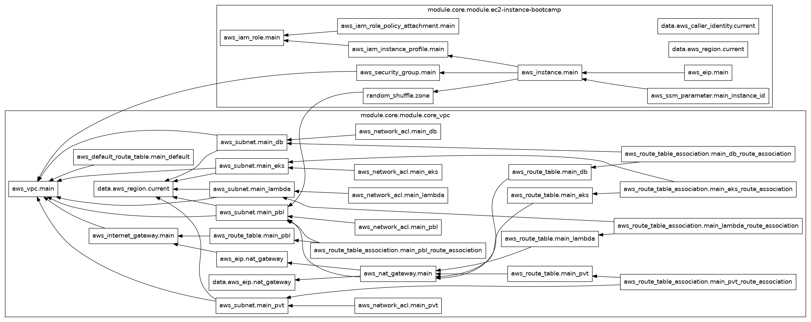

# Terraform AWS Tenant Architecture

This repository contains Terraform modules and examples for deploying a multi-tenant architecture on AWS. The architecture includes a Virtual Private Cloud (VPC) with public and private subnets, NAT gateways for outbound internet access from private subnets, and EC2 instances.

## Project Structure

The repository is organized into the following directories:

- [`modules/`](modules/): Contains reusable Terraform modules for deploying AWS resources.
    - [`modules/terraform-aws-vpc/`](modules/terraform-aws-vpc/): Module for creating VPCs and associated networking resources.
    - [`modules/terraform-aws-ec2/`](modules/terraform-aws-ec2/): Module for creating EC2 instances and related resources.
- [`tenant/`](tenant/): Contains example usage of the modules for different environments or tenants.
    - [`tenant/dev/`](tenant/dev/): Example deployment for a development environment.
        - [`tenant/dev/core/`](tenant/dev/core/): Core infrastructure configuration for the 'dev' environment.

## AWS Services and File Contents

Here's a breakdown of the AWS services used and the contents of the key Terraform files:

### [`modules/terraform-aws-vpc/`](modules/terraform-aws-vpc/)

This module is responsible for provisioning the network infrastructure using the following AWS services:
- **VPC**: The main isolated network space.
- **Internet Gateway (IGW)**: Allows communication between the VPC and the internet.
- **Subnets**: Divides the VPC into smaller network segments (public, private, EKS, database, Lambda).
- **NAT Gateway**: Enables instances in private subnets to connect to the internet.
- **Route Tables**: Define rules for directing network traffic.
- **Network Access Control Lists (NACLs)**: Provide stateless filtering of traffic at the subnet level.

Key files in this module:
- [`modules/terraform-aws-vpc/main.tf`](modules/terraform-aws-vpc/main.tf): Defines the core VPC and Internet Gateway resources.
- [`modules/terraform-aws-vpc/subnets.tf`](modules/terraform-aws-vpc/subnets.tf): Configures various types of subnets within the VPC.
- [`modules/terraform-aws-vpc/nat.tf`](modules/terraform-aws-vpc/nat.tf): Manages Elastic IP addresses and NAT Gateways.
- [`modules/terraform-aws-vpc/route.tf`](modules/terraform-aws-vpc/route.tf): Defines route tables and associations.
- [`modules/terraform-aws-vpc/nacl.tf`](modules/terraform-aws-vpc/nacl.tf): Configures Network Access Control Lists.
- [`modules/terraform-aws-vpc/outputs.tf`](modules/terraform-aws-vpc/outputs.tf): Defines the output values exported by the module.
- [`modules/terraform-aws-vpc/data.tf`](modules/terraform-aws-vpc/data.tf): Contains data sources used within the module.
- [`modules/terraform-aws-vpc/variables.tf`](modules/terraform-aws-vpc/variables.tf): Defines the input variables for the module.

### [`modules/terraform-aws-ec2/`](modules/terraform-aws-ec2/)

This module is responsible for provisioning EC2 instances and related resources using the following AWS services:
- **EC2**: Virtual servers in the cloud.
- **Security Groups**: Provide stateful filtering of traffic at the instance level.
- **IAM Instance Profile**: Grants permissions to the EC2 instance.
- **Elastic IP (EIP)**: A static public IPv4 address.
- **EBS Volumes**: Block storage volumes for EC2 instances.
- **AWS Systems Manager (SSM)**: For managing the EC2 instance.

Key files in this module:
- [`modules/terraform-aws-ec2/main.tf`](modules/terraform-aws-ec2/main.tf): Defines the EC2 instance resource, including configuration for AMI, instance type, networking, monitoring, and volume attachments. It also defines the IAM instance profile.
- [`modules/terraform-aws-ec2/sg.tf`](modules/terraform-aws-ec2/sg.tf): Configures the Security Group for the EC2 instance.
- [`modules/terraform-aws-ec2/iam.tf`](modules/terraform-aws-ec2/iam.tf): Defines the IAM role and policy used by the EC2 instance profile.
- [`modules/terraform-aws-ec2/eip.tf`](modules/terraform-aws-ec2/eip.tf): Manages the creation of an Elastic IP address.
- [`modules/terraform-aws-ec2/ssm.tf`](modules/terraform-aws-ec2/ssm.tf): Includes configurations related to AWS Systems Manager.
- [`modules/terraform-aws-ec2/data.tf`](modules/terraform-aws-ec2/data.tf): Contains data sources used within the module.
- [`modules/terraform-aws-ec2/variables.tf`](modules/terraform-aws-ec2/variables.tf): Defines the input variables for the module.

### [`tenant/dev/`](tenant/dev/)

This directory provides an example of how to use the modules for a development environment.
- [`tenant/dev/main.tf`](tenant/dev/main.tf): The main entry point for the 'dev' environment deployment, referencing the core infrastructure.
- [`tenant/dev/providers.tf`](tenant/dev/providers.tf): Configures the AWS provider and backend for the 'dev' environment.
- [`tenant/dev/core/vpc.tf`](tenant/dev/core/vpc.tf): Instantiates the `terraform-aws-vpc` module with specific configurations for the 'dev' environment VPC.
- [`tenant/dev/core/ec2.tf`](tenant/dev/core/ec2.tf): Instantiates the `terraform-aws-ec2` module with specific configurations for the 'dev' environment EC2 instance.
- [`tenant/dev/core/variable.tf`](tenant/dev/core/variable.tf): Defines the input variables specific to the 'dev' environment.
- [`tenant/dev/core/userdata.sh`](tenant/dev/core/userdata.sh): A shell script used as user data for the EC2 instance during launch.

## How it Works and What it Does

This repository provides a modular and reusable approach to deploying a basic multi-tenant architecture on AWS using Terraform.

The core components are the `terraform-aws-vpc` and `terraform-aws-ec2` modules. The VPC module sets up the fundamental network infrastructure, including the VPC itself, subnets (categorized for different purposes like public, private, database), internet connectivity via an Internet Gateway, and controlled outbound access for private subnets using NAT Gateways. Route tables and NACLs are configured to manage traffic flow and provide a layer of network security.

The EC2 module is designed to deploy and configure EC2 instances within the created VPC. It handles the instance definition (AMI, type, networking), security group associations for traffic control, IAM roles for permissions, optional Elastic IP allocation, EBS volume attachments for storage, and integration with AWS Systems Manager for management.

The `tenant/dev` directory serves as a concrete example of how to compose these modules to create a specific environment. By defining variables and instantiating the modules in files like [`tenant/dev/core/vpc.tf`](tenant/dev/core/vpc.tf) and [`tenant/dev/core/ec2.tf`](tenant/dev/core/ec2.tf), a complete, deployable architecture for a development tenant is defined. The `userdata.sh` script allows for initial configuration or application deployment on the EC2 instance upon launch.

In essence, this repository allows users to quickly and consistently deploy isolated network environments (VPCs) and compute resources (EC2 instances) within those environments, providing a foundation for building multi-tenant applications on AWS. The modular design promotes reusability and simplifies the management of infrastructure across different tenants or environments.

